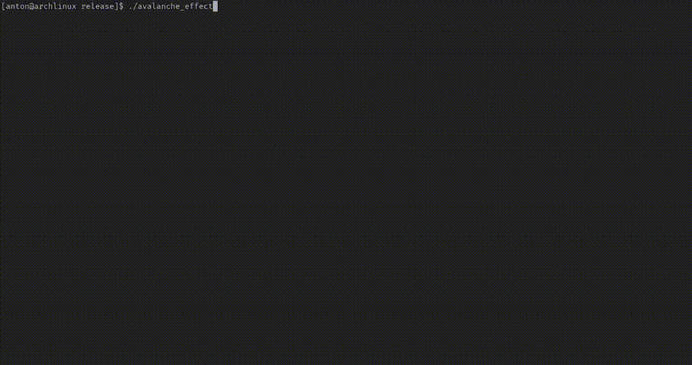

# Avalanche Effect


[](https://github.com/anisimov-anthony/avalanche_effect)
[](LICENSE)



##  About the Project

This project demonstrates the **Avalanche Effect** — a fundamental property of cryptographic hash functions and ciphers.
A tiny change in the input (even flipping a single bit) leads to a drastic, unpredictable change in the output.

##  Features

- Implemented in Rust with a simple, clean structure
- Shows a clear demonstration of the avalanche effect
- Lightweight and easy to run
- Useful as an educational tool for understanding cryptographic principles
- **Comprehensive test coverage (92.94%)** with 89 unit and integration tests

## Prerequisites
- Install [Rust](https://rustup.rs)

## Installation & Run
```bash
git clone https://github.com/anisimov-anthony/avalanche_effect.git
cd avalanche_effect
cargo run --release
```

## Testing

This project has comprehensive test coverage to ensure reliability and correctness.

### Run Tests
```bash
# Run all tests
cargo test

# Run tests with output
cargo test -- --nocapture

# Run specific test
cargo test test_name
```

### Code Coverage

The project maintains **92.94% code coverage** across all modules:

| Module | Regions | Functions | Lines | Status |
|--------|---------|-----------|-------|--------|
| **app/manipulations.rs** | 100.00% | 100.00% | 100.00% | ✅ Perfect |
| **app/automatic.rs** | 98.36% | 100.00% | 100.00% | ✅ Excellent |
| **app/manual.rs** | 98.81% | 100.00% | 100.00% | ✅ Excellent |
| **app/mod.rs** | 97.66% | 100.00% | 98.77% | ✅ Excellent |
| **ui.rs** | 94.06% | 100.00% | 95.10% | ✅ Excellent |
| **app/statistics.rs** | 94.74% | 100.00% | 100.00% | ✅ Excellent |

**Total: 89 tests** covering:
- 72 unit tests for core app logic
- 14 integration tests for end-to-end workflows
- 13 UI rendering tests

### Generate Coverage Report
```bash
# Install coverage tool (one-time setup)
cargo install cargo-llvm-cov
rustup component add llvm-tools-preview

# Generate HTML coverage report
cargo llvm-cov --all-features --workspace --html

# View report at: target/llvm-cov/html/index.html
```

## License

This project is licensed under the `MIT License`.

## Contribution

Contributions are welcome!
If you’d like to improve this project, feel free to fork the repo, create a new branch, and submit a pull request.